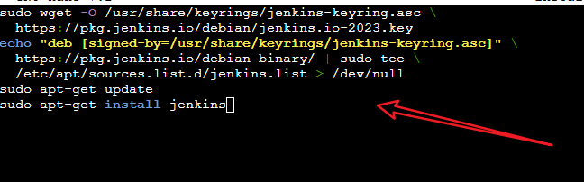

# JenkinsAssignment
## Java Installation
- 3 instances(The master will be used as the developer machine while the remaining 2 instances will be used for production server and test server)  are created on AWS \
-Java 17 is installed on each of them. \

## Jenkins Installaton 
- On the master Jenkins is installed, Jenkins installation documentation is saved on a sh file and ran as shown in the second diagram below.

- Check if Jenkins services is running

- Access Jenkins Dashboard \
The Jenkins master public Ip is pasted in the browser to access the jenkins dashboard. The path on the Jenkins dashboard is copied back to the terminal to get the admin password  \

## Assignment 1 and 2

### Git
Index.html page was created committed to git, the develop branch was also created, the aboutus.htm page was created.
#### Master Branch Commit

#### Develop Branch Commit

#### Created Nodes(s)
Here the ProdServer and TestServer Nodes were created. The  private IP of each of the servers where pasted under host in the under lunch method.

#### Create  Job
Created the TestJob and ProdJob, In the configuration of the TestJob, my git repository was specified and under branch i added the develop branch, under the build triggered, the GITScm polling was selected.

### Added GitHub Webhook
A webhook was added to my repository  by pasting my Jenkins IP address. See the img below

### Pushing Develop Branch To Github
The develop branch was pushed to git hub and this automatically triggered the test job  and automatically the files on the develop branch was pushed to the Test server

The TestServer after the push of develop branch

The Pushing Master branch

The ProdServer after the push of master branch

### Assignment 3
The img shows the configuration setting for the prodjob. This job runs after the the test job builds successfully

#### Configuration of jobs

TestJob Configuration

ProdJob Configuration

#### Test Server after a successfull Testjob Build
After a Successfull 

#### Prod Server after an automatic building of Prodjob after a successful testjob build

